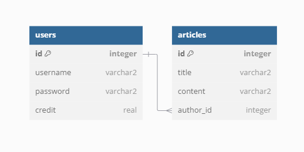

# Fejezetek
- [Rendszer célja](#1-rendszer-célja)
- [Projektterv](#2-projektterv)
- [Üzleti folyamatok modellje](#3-üzleti-folyamatok-modellje)
- [Követelmények](#4-követelmények)
- [Funkcionális terv](#5-funkcionális-terv)
- [Fizikai környezet](#6-fizikai-környezet)
- [Architekturális terv](#7-architekturális-terv)
- [Implementációs terv](#8-implementációs-terv)
- [Tesztterv](#9-tesztterv)
- [Telepítési terv](#10-telepítési-terv)
- [Karbantartási terv](#11-karbantartási-terv)

# 1. Rendszer célja

A hírportál célja egy olyan platform létrehozása, ahol a felhasználók regisztrálhatnak, bejelentkezhetnek, híreket írhatnak, és ezzel social credit rendszert használhatnak.

A rendszer célja a minőségi tartalom előmozdítása és a felhasználói közösség felelősségteljes viselkedésének ösztönzése.

# 2. Projektterv

- **Felhasználói interfész létrehozása**
    - Home screen
    - Regisztrálás
    - Bejelentkezés
    - Hírírás
    - Aktivitás ellenőrzés
- **Social credit mechanizmus kidolgozása**
    - Fiókjogok állítása social credit alapján:
        - Alacsony szintnél hírírás jogának elvétele.
        - Nagyon alacsony szintnél fiók törlése.

# 3. Üzleti folyamatok modellje

1. **Felhasználói regisztráció**:
    - A felhasználó megadja a szükséges adatokat.
    - A szükséges adatok közé tartozik a név, e-mail cím, jelszó.
    - Ezek az adatok adatbázisban kerülnek mentésre.

2. **Bejelentkezés**:
    - A felhasználó a regisztrált e-mail címével és jelszavával tud belépni.
    - A rendszer az adatbázisban tárolt adatokat ellenőrzi a bejelentkezés során.
3. **Anonymous felhasználó**:
    - Az anonymous felhasználók a nem regisztrált, nem bejelentkezett felhasználók.
    - Az anonymous felhaszálók olvashatják a közzé tett híreket, de nem reagálhatnak rájuk.
    - Az anonymous felhasználók nem írhatnak híreket.
3. **Hírírás**:
    - A felhasználó hírt írhat a portálon, amit közzé tehet az oldalon.
    - A felhasználó által írt híreket minden felhasználó, illetve anonym felhasználó olvashatja.
4. **Social credit**:
    - A regisztrált felhasználók social creditet szerezhetnek illetve veszíthetnek el.
    - Alacsony social credit szintnél a felhasználó elveszti hírírási jogát.
    - Nagyon alacsony social credit szintnél a felhasználó fiókja törlődik.

# 4. Követelmények

1. ### **Funkcionális követelmények**:
    - Regisztrációs és bejelentkezési rendszer.
    - Hírek írásának és olvasásának funkciója.
    - Social credit rendszer integrálása.
2. ### **Nem funkcionális követelmények**:
    - Magas szintű biztonság.
    - Felhasználóbarát felület.
    - Teljesítmény és skálázhatóság.

# 5. Funkcionális terv

### **A rendszer fő funkciói a következők**:

- Felhasználói fiók létrehozása, kezelése.
- Hírek létrehozása ás publikálása az oldalon.
- Social credit nyomon követése és kezelése.
- Statisztikák és riportok készítése a felhasználók aktivitásáról.

# 6. Fizikai környezet

A rendszer futtatásához szükséges fizikai környezet az alábbiakat foglalja magában:

1. **Szerverek**:
    - A hírportál számára dedikált szerverek, amelyek képesek a felhasználói adatok és a hírek tárolására, valamint a rendszer folyamatos működésének biztosítására.
2. **Hálózati infrastruktúra**:
    - Stabil internetkapcsolat, amely lehetővé teszi a felhasználók számára a hírportál elérését.
3. **Biztonsági rendszerek**:
    - Tűzfalak és egyéb biztonsági megoldások, amelyek védik a rendszert a külső támadásoktól.

# 7. Architekturális terv

A hírportál architektúrája a következő elemekből áll:

1. **Frontend**:
    - A felhasználói felület, amely HTML, CSS és JavaScript technológiák használatával készült, lehetővé téve a felhasználók számára a hírek olvasását, írását és a fiókjuk kezelését.
2. **Backend**:
    - Az adatkezelés és logika végrehajtásáért felelős réteg, amely programozási nyelvek (Python) és keretrendszerek (pl. Django) segítségével van megvalósítva.
3. **Adatbázis**:
    - Relációs adatbázis (SQLite) a felhasználói adatok és hírek tárolására, amely a backenddel kommunikál a szükséges információk lekérdezésére és módosítására.

# 8. Adatbázis terv

- **8.1 Adatbázis táblák**
1. **users tábla**
    - **id**: Egyedi azonosító, amely automatikusan növekszik.
    - **username**: A felhasználónevet tároló mező, amely nem lehet üres.
    - **password**: A jelszót tároló mező, amely nem lehet üres.
    - **credit**: A felhasználó egyenlegét tároló mező, alapértelmezett értéke 500.

2. **articles tábla**
    - **id**: Egyedi azonosító, amely automatikusan növekszik.
    - **title**: A cikk címe, amely nem lehet üres.
    - **content**: A cikk tartalma, amely nem lehet üres.
    - **author_id**: Az író azonosítója, amely egy külső kulcs a users táblából.

- **8.2 Adatbázis ábra**

    

- **8.3 Adatbázis kapcsolatok**
    - A articles tábla author_id mezője kapcsolódik a users tábla id mezőjéhez, ami lehetővé teszi, hogy minden cikkhez egy szerzőt rendeljünk.

- **8.4 Használati esetek**
    - A felhasználók regisztrálhatnak és jelszót választhatnak.
    - Cikkek létrehozása és tárolása a felhasználók által.

- **8.5 Fejlesztési lehetőségek**
    - Cikkek módosítása/törlése.
    - Commentek a cikkhez.
    - Reakciók a cikkhez (Emoji).

# 9. Implementációs terv
1. **Kezdeti fejlesztés**:
    - A felhasználói regisztráció, bejelentkezés létrehozása.
    - Adatbázis implementálása a felhasználói adatok tárolására
    - GUI fejlesztése.
2. **Funkcionális fejlesztés**:
    - Az hírek közzétételének, social credit manipulálásának, nem megbízható források letiltásának implementálása.
4. **Tesztelés**:
    - Minden funkció tesztelése különböző felhasználói forgatókönyvekkel.
5. **Finomítás**:
    - Az esetleges hibák javítása és az alkalmazás teljesítményének optimalizálása.
    - A fejlesztés során folyamatosan figyelemmel kísérjük a kód minőségét és a legjobb gyakorlatokat alkalmazzuk, hogy a karbantartás és a további fejlesztések a jövőben zökkenőmentesen valósuljanak meg, végig törekedünk a tiszta kódra.
6. **Verziókezelés**:
    - A projekt során verziókezelő rendszert használunk a kód nyomon követésére és a csapatmunkához való alkalmazkodás érdekében.

# 10. Tesztterv

A tesztelési folyamat az alábbi lépéseket tartalmazza:

1. **Funkcionális tesztelés**:
    - Minden funkció tesztelése a specifikációknak megfelelően, beleértve a regisztrációt, bejelentkezést, hírírást és social credit rendszer működését.
2. **Teljesítménytesztelés**:
    - A rendszer terhelés alatti viselkedésének ellenőrzése, hogy biztosítsa a gyors válaszidőt és a stabil működést.
3. **Biztonsági tesztelés**:
    - A rendszer sebezhetőségeinek feltérképezése és a potenciális támadási felületek azonosítása.
4. **Felhasználói tesztelés**:
    - A végfelhasználók bevonásával végzett tesztelés, hogy értékeljék a felhasználói élményt és az interfész használhatóságát.

# 11. Telepítési terv
A telepítési terv az alábbi lépéseket tartalmazza:

1. **Előkészítés**:
    - A rendszer és az összes szükséges komponens (szerverek, adatbázis, stb.) előkészítése.
2. **Telepítés**:
    - A rendszer telepítése a kiválasztott szerverekre és az adatbázis beállítása.
3. **Következő lépések**:
    - A rendszer működésének ellenőrzése, a felhasználói fiókok létrehozása és a rendszer használatának megkezdése.

# 12. Karbantartási terv

A karbantartási terv a következőket foglalja magában:

1. **Rendszeres frissítések**:
    - A szoftverfrissítések és biztonsági javítások rendszeres végrehajtása.
2. **Hibajavítás**:
    - A felhasználók által bejelentett hibák gyors kezelése és javítása.
    - Egyéb észrevett hibák javítása.
3. **Teljesítményfigyelés**:
    - A rendszer teljesítményének folyamatos figyelemmel kísérése és optimalizálása.
4. **Felhasználói támogatás**:
    - A felhasználók számára segítségnyújtás a rendszer használatával kapcsolatos kérdésekben.

# 13. Képernyő terv

# 14. Fogalomtár

- **Frontend**: A frontend a szoftverfejlesztés azon része, amely a felhasználók számára látható és interaktív elemeket tartalmaz, mint például a weboldalak dizájnja, a gombok, űrlapok és menük.
- **Backend**: A backend a szoftverfejlesztés azon része, amely a felhasználói felület mögött működik, és felelős az adatok feldolgozásáért, tárolásáért és logikájáért.
- **GUI**: A GUI (Graphical User Interface) egy vizuális felhasználói interfész, amely lehetővé teszi a felhasználók számára, hogy grafikus elemek, például ikonok, gombok és ablakok segítségével interakcióba lépjenek a számítógépes programokkal.
- **Adatbázis**: Az adatbázis egy strukturált adattároló, amely lehetővé teszi adatok rendszerezett, biztonságos és hatékony tárolását, lekérdezését és kezelését (Név, jelszó).
- **Social credit**: A social credit egy olyan rendszer, amely a polgárok viselkedését és tevékenységeit értékeli, gyakran pontozás vagy rangsorolás alapján. Ezt a rendszert legjobban Kínában ismerik, ahol a kormány különböző adatokat gyűjt a polgárokról, például a pénzügyi viselkedésükről, a közlekedési szabálysértéseikről, és a közösségi médiában való aktivitásukról. A célja, hogy ösztönözze a "jó" viselkedést és csökkentse a "rossz" viselkedést, például a törvényszegéseket.
- **Anonymous user**: Azok a felhasználók, akik rátekintenek az oldalra, de nem jelentkeznek be. Limitált jogokkal rendelkeznek (pl.: hírolvasás). 